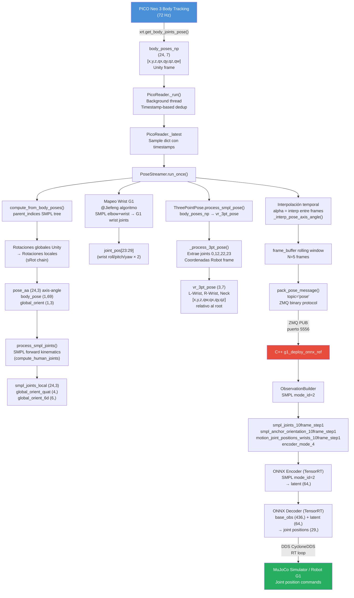
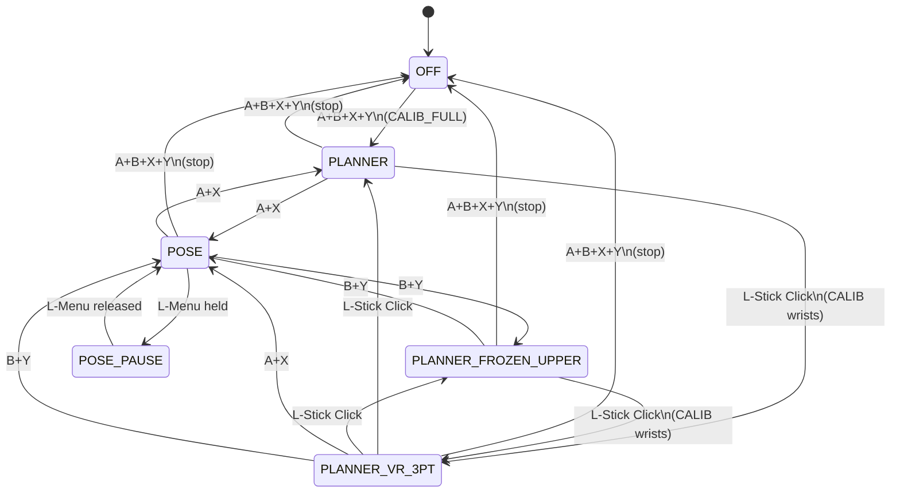
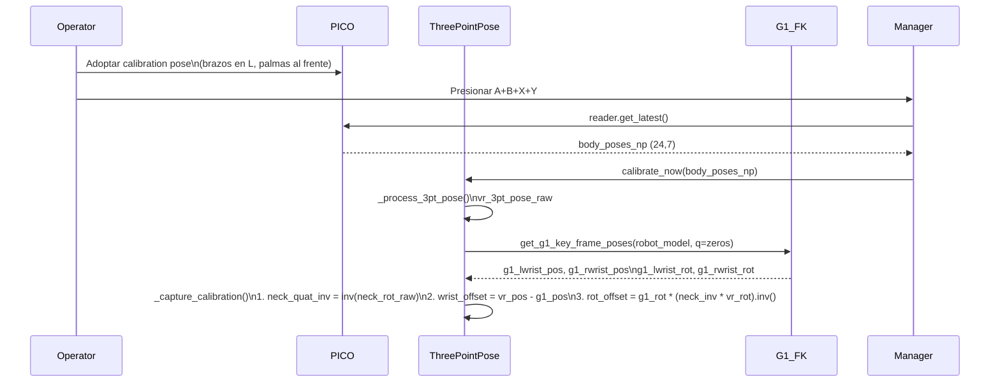
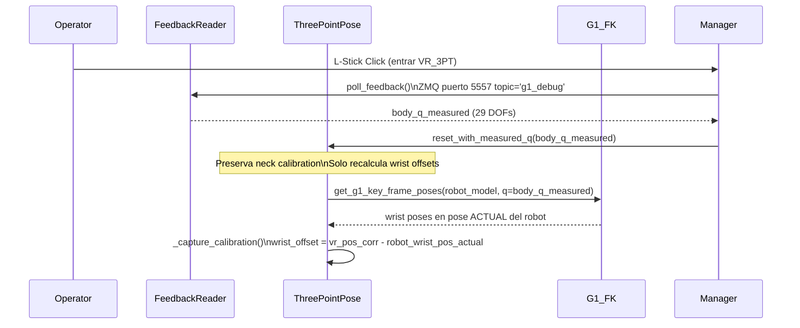

# Reverse Engineering: GR00T Whole-Body Control — Flujo Completo de Datos

> **Scope:** Cómo los datos del casco PICO (VR) fluyen desde la captura física hasta los comandos de articulación del robot G1, pasando por los encoders de la política.

---

## Tabla de Contenidos

1. [Arquitectura General del Sistema](#1-arquitectura-general-del-sistema)
2. [Los Tres Procesos Concurrentes](#2-los-tres-procesos-concurrentes)
3. [Origen de los Datos: el PICO y XRoboToolkit](#3-origen-de-los-datos-el-pico-y-xrobotoolkit)
4. [Procesamiento Python — `pico_manager_thread_server.py`](#4-procesamiento-python--pico_manager_thread_serverpy)
5. [Protocolo ZMQ: El Puente Python → C++](#5-protocolo-zmq-el-puente-python--c)
6. [C++ Deployment: `g1_deploy_onnx_ref`](#6-c-deployment-g1_deploy_onnx_ref)
7. [Espacio de Observaciones y los Tres Encoders](#7-espacio-de-observaciones-y-los-tres-encoders)
8. [Flujo Detallado: Modo SMPL (POSE)](#8-flujo-detallado-modo-smpl-pose)
9. [Flujo Detallado: Modo TELEOP (VR 3-Point)](#9-flujo-detallado-modo-teleop-vr-3-point)
10. [Flujo Detallado: Modo G1 (PLANNER)](#10-flujo-detallado-modo-g1-planner)
11. [Máquina de Estados del Manager](#11-máquina-de-estados-del-manager)
12. [Calibración del VR 3-Point](#12-calibración-del-vr-3-point)
13. [Transformación de Coordenadas: Unity → Robot](#13-transformación-de-coordenadas-unity--robot)
14. [Formato de Datos del Dataset (GR00T / LeRobot)](#14-formato-de-datos-del-dataset-groot--lerobot)
15. [Glosario](#15-glosario)

---

## 1. Arquitectura General del Sistema

El sistema completo se divide en tres procesos que corren en paralelo y se comunican por red local:

```
┌──────────────────────────────────────────────────────────────────────┐
│                         SISTEMA DE TELEOP                            │
│                                                                      │
│  ┌─────────────────┐    ZMQ PUB/SUB     ┌──────────────────────┐   │
│  │   Terminal 3    │ ─────────────────► │    Terminal 2        │   │
│  │  Python Teleop  │   puerto 5556      │  C++ Deployment      │   │
│  │  (PICO Manager) │                   │  (g1_deploy_onnx_ref) │   │
│  └─────────────────┘                   └──────────┬───────────┘   │
│          ▲                                         │               │
│          │ XRoboToolkit SDK                        │ DDS / CycloneDDS
│          │ (WiFi / USB)                            ▼               │
│   ┌──────┴──────┐                      ┌──────────────────────┐   │
│   │  PICO Neo 3 │                      │    Terminal 1        │   │
│   │  (VR HMD)   │                      │  MuJoCo Simulator    │   │
│   └─────────────┘                      │  (run_sim_loop.py)   │   │
│                                        └──────────────────────┘   │
└──────────────────────────────────────────────────────────────────────┘
```

**ZMQ Feedback (puerto 5557):** El C++ también envía telemetría del robot de vuelta al Python (`g1_debug` topic), usada para recalibración del VR 3PT y para congelar el upper body.

---

## 2. Los Tres Procesos Concurrentes

### Terminal 1 — Simulador MuJoCo (`run_sim_loop.py`)

```python
# Archivo: gear_sonic/scripts/run_sim_loop.py
robot_model = instantiate_g1_robot_model()
sim = SimulatorFactory.create_simulator(config, env_name)
SimulatorFactory.start_simulator(sim, ...)
```

- Instancia el modelo del robot G1 desde URDF.
- Abre la ventana gráfica MuJoCo.
- Escucha comandos de joint positions vía DDS (CycloneDDS, interfaz loopback `lo`).
- Devuelve estado del robot (posiciones, velocidades, IMU) al C++ deployment.

### Terminal 2 — C++ Deployment (`deploy.sh`)

Llama internamente a:
```bash
just run g1_deploy_onnx_ref $TARGET $CHECKPOINT_DECODER $MOTION_DATA \
    --obs-config $OBS_CONFIG \
    --encoder-file $CHECKPOINT_ENCODER \
    --planner-file $PLANNER \
    --input-type manager \
    --output-type all \
    --zmq-host $ZMQ_HOST
```

Los modelos son:
- `policy/release/model_decoder.onnx` — Decoder TensorRT
- `policy/release/model_encoder.onnx` — Encoder TensorRT
- `planner/target_vel/V2/planner_sonic.onnx` — Planner locomotion ONNX

### Terminal 3 — PICO Teleop Streamer (`pico_manager_thread_server.py`)

```bash
python gear_sonic/scripts/pico_manager_thread_server.py --manager \
    --vis_vr3pt --vis_smpl
```

- Lee datos del casco PICO via `xrobotoolkit_sdk`.
- Procesa en función del modo activo (SMPL / VR3PT / Planner).
- Publica mensajes ZMQ al C++ deployment.

---

## 3. Origen de los Datos: el PICO y XRoboToolkit

El casco PICO Neo 3 incluye **body tracking** (seguimiento del cuerpo completo). La SDK `xrobotoolkit_sdk` (alias `xrt`) expone:

```python
xrt.get_body_joints_pose()   # → lista de 24 poses en frame Unity
xrt.get_time_stamp_ns()      # → timestamp de hardware
xrt.get_left_trigger()       # → float [0,1]
xrt.get_right_trigger()      # → float [0,1]
xrt.get_left_grip()          # → float [0,1]
xrt.get_right_grip()         # → float [0,1]
xrt.get_left_axis()          # → [lx, ly]  joystick izquierdo
xrt.get_right_axis()         # → [rx, ry]  joystick derecho
xrt.get_A_button()           # → bool
xrt.get_B_button()           # → bool
xrt.get_X_button()           # → bool
xrt.get_Y_button()           # → bool
xrt.get_left_axis_click()    # → bool (L-Stick click)
xrt.get_left_menu_button()   # → bool
```

### Formato Raw de Body Joints

`xrt.get_body_joints_pose()` devuelve **24 joints SMPL** en el sistema de coordenadas Unity:

```
body_poses_np: np.ndarray shape (24, 7)
  Cada fila: [x, y, z, qx, qy, qz, qw]  ← quaternion scalar-LAST
  Frame: Unity (Y-up, left-handed, Z-forward)
```

Los 24 joints SMPL y su topología (índices de padres):

| Índice | Joint           | Padre |
|--------|-----------------|-------|
| 0      | Pelvis (Root)   | -1    |
| 1      | L-Hip           | 0     |
| 2      | R-Hip           | 0     |
| 3      | Spine1          | 0     |
| 4      | L-Knee          | 1     |
| 5      | R-Knee          | 2     |
| 6      | Spine2          | 3     |
| ...    | ...             | ...   |
| 12     | Neck            | 9     |
| 15     | Head            | 12    |
| 22     | L-Wrist         | 20    |
| 23     | R-Wrist         | 21    |

---

## 4. Procesamiento Python — `pico_manager_thread_server.py`

### 4.1 Clases Principales

```
pico_manager_thread_server.py
├── PicoReader          ─ hilo background que lee XRT lo más rápido posible
├── ThreePointPose      ─ extrae y calibra la pose VR 3-point (L-Wrist, R-Wrist, Neck)
├── PoseStreamer         ─ loop de streaming para modo POSE (SMPL)
├── PlannerStreamer      ─ loop de control para modos PLANNER / VR_3PT
├── FeedbackReader      ─ lee telemetría del robot desde ZMQ puerto 5557
├── YawAccumulator      ─ acumula el ángulo yaw del joystick derecho
└── run_pico_manager()  ─ orquestador principal (máquina de estados)
```

### 4.2 `PicoReader` — Lectura en Background

```python
class PicoReader:
    def _run(self):
        while not self._stop.is_set():
            stamp_ns = xrt.get_time_stamp_ns()
            if stamp_ns == self._last_stamp_ns:
                time.sleep(0.000001)   # espera nuevo frame
                continue
            body_poses = xrt.get_body_joints_pose()
            sample = {
                "body_poses_np": np.array(body_poses),   # (24,7)
                "timestamp_ns": stamp_ns,
                "dt": device_dt,
                "fps": self._fps_ema,
            }
            with self._lock:
                self._latest = sample
```

Opera a la máxima velocidad que permita el hardware PICO (~72 Hz típico), usando timestamps de hardware para medir el dt real.

### 4.3 `compute_from_body_poses()` — SMPL Processing

Convierte las 24 poses globales del PICO al formato SMPL (rotaciones locales en axis-angle):

```
body_poses_np (24, 7) Unity frame
    │
    ▼
global_quats = body_poses_np[:, [6,3,4,5]]   ← reorder wxyz
    │
    ▼ sRot * R_y(180°)   ← flip facing direction
    │
    ▼ local_rot[i] = global_rot[parent[i]].inv() * global_rot[i]
    │
    ▼ pose_aa = rotvec (24, 3)
    │
    ├─ body_pose   = pose_aa[1:].flatten()  → (T, 69)  [23 joints × 3]
    ├─ global_orient = pose_aa[0]           → (T, 3)   [pelvis axis-angle]
    └─ transl       = positions[0]          → (T, 3)

    │
    ▼ process_smpl_joints()
    │   ├─ angle_axis_to_quaternion(global_orient)
    │   ├─ smpl_root_ytoz_up()              ← Y-up → Z-up conversion
    │   ├─ compute_human_joints()           ← SMPL forward kinematics
    │   ├─ remove_smpl_base_rot()           ← remove base orientation
    │   └─ quat_apply(inv_root, joints)
    │
    ├─ smpl_joints_local   (24, 3)  ← posiciones locales de joints
    ├─ global_orient_quat  (4,)     ← orientación global del pelvis
    └─ global_orient_6d    (6,)     ← representación 6D (para el encoder)
```

---

## 5. Protocolo ZMQ: El Puente Python → C++

### Formato de Mensaje

Todos los mensajes ZMQ tienen la estructura:

```
[topic_bytes] + [1280-byte JSON header] + [binary payload]
```

El header JSON describe cada campo:
```json
{
  "v": 3,
  "endian": "le",
  "count": 1,
  "fields": [
    {"name": "smpl_pose", "dtype": "f32", "shape": [10, 21, 3]},
    {"name": "smpl_joints", "dtype": "f32", "shape": [10, 24, 3]},
    ...
  ]
}
```

### Topics ZMQ

| Topic          | Origen              | Destino   | Descripción                                     |
|----------------|---------------------|-----------|-------------------------------------------------|
| `pose`         | PoseStreamer        | C++       | Batch de frames SMPL (modo POSE/SMPL)           |
| `planner`      | PlannerStreamer     | C++       | Comandos de movimiento y VR 3PT (modos planner) |
| `command`      | Manager             | C++       | start/stop/planner flag                         |
| `manager_state`| Manager             | C++       | stream_mode actual + data collection toggles    |
| `g1_debug`     | C++ deployment      | Python    | Feedback del robot (joint state medido)         |

### Mensaje `pose` (modo SMPL)

```python
numpy_data = {
    "smpl_pose":           np.ndarray (N, 21, 3),   # axis-angle de 21 joints
    "smpl_joints":         np.ndarray (N, 24, 3),   # posiciones locales de joints
    "body_quat_w":         np.ndarray (N, 4),        # quaternion global del pelvis
    "joint_pos":           np.ndarray (N, 29),       # posiciones de joints G1 (wrists)
    "joint_vel":           np.ndarray (N, 29),       # velocidades (zeros en teleop)
    "vr_position":         np.ndarray (9,),          # [L-Wrist, R-Wrist, Neck] pos
    "vr_orientation":      np.ndarray (12,),         # [L-Wrist, R-Wrist, Neck] quat wxyz
    "frame_index":         np.ndarray (N,),
    "left_trigger":        float32,
    "right_trigger":       float32,
    "left_grip":           float32,
    "right_grip":          float32,
    "pico_dt":             float32,
    "pico_fps":            float32,
    "left_hand_joints":    float32 array,
    "right_hand_joints":   float32 array,
    "heading_increment":   float32,
    ...
}
```

donde `N = num_frames_to_send = 5` (ventana deslizante de frames).

### Mensaje `planner` (modos PLANNER / VR_3PT)

```python
{
    "mode":               int32,       # LocomotionMode enum value
    "movement":           float32[3],  # vector de movimiento global [x,y,z]
    "facing":             float32[3],  # dirección frontal [x,y,z]
    "speed":              float32,
    "height":             float32,
    # opcional en VR_3PT:
    "vr_position":        float32[9],  # [L-Wrist, R-Wrist, Neck] × 3
    "vr_orientation":     float32[12], # [L-Wrist, R-Wrist, Neck] × 4
    # opcional en FROZEN_UPPER:
    "upper_body_position": float32[17],
    "left_hand_joints":    float32[...],
    "right_hand_joints":   float32[...],
}
```

---

## 6. C++ Deployment: `g1_deploy_onnx_ref`

El binario C++ es el núcleo del sistema en tiempo real. Sus responsabilidades:

```
┌────────────────────────────────────────────────────────┐
│                  g1_deploy_onnx_ref                    │
│                                                        │
│  ZMQ SUB ──► InputParser                              │
│    (pose / planner / command)                         │
│                   │                                    │
│                   ▼                                    │
│           ObservationBuilder                          │
│    (observation_config.yaml)                          │
│           │            │                              │
│           │            ▼                              │
│           │     ONNX Encoder (TensorRT)               │
│           │     [mode-dependent]  → latent (64,)      │
│           │            │                              │
│           ▼            ▼                              │
│     RobotState    ONNX Decoder (TensorRT)             │
│     (DDS/Cyclone)  [base obs + latent] → actions      │
│                         │                             │
│                         ▼                             │
│              ONNX Planner (modo planner)              │
│                         │                             │
│                         ▼                             │
│              DDS Publisher → Robot / MuJoCo           │
│                                                       │
│  ZMQ PUB ◄── g1_debug feedback (joint states)        │
└────────────────────────────────────────────────────────┘
```

### Parámetros de Lanzamiento

| Parámetro             | Valor por defecto                              | Descripción                          |
|-----------------------|------------------------------------------------|--------------------------------------|
| `TARGET`              | `lo` (sim) / `enP8p1s0` (real)                | Interfaz DDS para comunicación robot |
| `CHECKPOINT_DECODER`  | `policy/release/model_decoder.onnx`            | Decoder ONNX (TensorRT)              |
| `MOTION_DATA`         | `reference/example/`                           | Datos de referencia de movimiento    |
| `--obs-config`        | `policy/release/observation_config.yaml`       | Define el espacio de observaciones   |
| `--encoder-file`      | `policy/release/model_encoder.onnx`            | Encoder ONNX (TensorRT)              |
| `--planner-file`      | `planner/target_vel/V2/planner_sonic.onnx`     | Planner locomotion ONNX              |
| `--input-type`        | `manager`                                      | Tipo de input (ZMQ manager)          |
| `--output-type`       | `all`                                          | DDS + debug output                   |
| `--zmq-host`          | `localhost`                                    | Host del ZMQ publisher Python        |

---

## 7. Espacio de Observaciones y los Tres Encoders

El archivo `observation_config.yaml` define dos capas de observaciones:

### 7.1 Observaciones Base (siempre activas — 436 dims total)

Estas se alimentan directamente al Decoder, representan el estado actual del robot:

| Observación                            | Descripción                                          |
|----------------------------------------|------------------------------------------------------|
| `token_state`                          | Token de tarea/modo (embedding)                      |
| `his_base_angular_velocity_10frame_step1` | Historial 10 frames de velocidad angular base (IMU) |
| `his_body_joint_positions_10frame_step1`  | Historial 10 frames de posiciones de joints          |
| `his_body_joint_velocities_10frame_step1` | Historial 10 frames de velocidades de joints         |
| `his_last_actions_10frame_step1`          | Historial 10 frames de acciones previas              |
| `his_gravity_dir_10frame_step1`           | Historial 10 frames de dirección de gravedad (IMU)   |

### 7.2 Observaciones del Encoder (64 dims de salida)

El encoder recibe observaciones **dependientes del modo** y produce un vector latente de 64 dimensiones que se concatena con las observaciones base antes de entrar al Decoder.

```yaml
encoder:
  dimension: 64
  encoder_modes:
    - name: "g1"      # modo_id: 0  →  PLANNER
    - name: "teleop"  # modo_id: 1  →  VR_3PT
    - name: "smpl"    # modo_id: 2  →  POSE
```

### 7.3 Tabla de Inputs por Encoder

| Observación del Encoder                    | G1 (0) | Teleop (1) | SMPL (2) | Descripción                                          |
|--------------------------------------------|:------:|:----------:|:--------:|------------------------------------------------------|
| `encoder_mode_4`                           | ✓      | ✓          | ✓        | One-hot vector de 4 bits indicando el modo activo    |
| `motion_joint_positions_10frame_step5`     | ✓      |            |          | 10 frames (cada 5 pasos) de posiciones de joints     |
| `motion_joint_velocities_10frame_step5`    | ✓      |            |          | 10 frames (cada 5 pasos) de velocidades de joints    |
| `motion_anchor_orientation_10frame_step5`  | ✓      |            |          | 10 frames de orientación del anchor (IMU)            |
| `motion_joint_positions_lowerbody_10frame_step5` |  | ✓          |          | Solo lower body, 10 frames step5                     |
| `motion_joint_velocities_lowerbody_10frame_step5`|  | ✓          |          | Solo lower body velocidades, 10 frames step5         |
| `vr_3point_local_target`                   |        | ✓          |          | Posición de L-Wrist, R-Wrist, Neck (frame robot)     |
| `vr_3point_local_orn_target`               |        | ✓          |          | Orientación de L-Wrist, R-Wrist, Neck (quaternion)   |
| `motion_anchor_orientation`                |        | ✓          |          | Orientación del anchor actual (sin historial)        |
| `smpl_joints_10frame_step1`                |        |            | ✓        | 10 frames paso a paso de joints SMPL (24×3)          |
| `smpl_anchor_orientation_10frame_step1`    |        |            | ✓        | 10 frames de orientación global del pelvis           |
| `motion_joint_positions_wrists_10frame_step1` |     |            | ✓        | 10 frames de posiciones de muñecas del robot         |

---

### 7.4 Reemplazar el VR (SMPL) con una NN ≤ 132 dims

Tu duda clave en modo **SMPL / whole-body** es: el encoder SMPL en C++ consume observaciones enormes (p.ej. `smpl_joints_10frame_step1` = 720D, `smpl_anchor_orientation_10frame_step1` = 60D, `motion_joint_positions_wrists_10frame_step1` = 60D, más `encoder_mode_4`), y luego las comprime a `token_state` (64D). Si tu red solo puede “botar” hasta **132D**, hay dos estrategias:

#### Opción A (directa, pero pesada): predecir observaciones SMPL completas

- Tu NN intentaría predecir *exactamente* los tensores que el encoder SMPL requiere (al menos 840D + extras), lo cual **no cabe** en 132D.
- Conclusión: **no es viable** si te ciñes al contrato actual del encoder SMPL.

#### Opción B (la recomendada): predecir el `token_state` (64D) y saltarte el encoder

El deployment C++ soporta explícitamente **tokens externos**:

- Si `token_state` está habilitado y **no hay encoder** (o llega token externo), el control loop copia `token_state` desde el input en lugar de correr el encoder.
- Hay un modo de streaming ZMQ dedicado: **Protocol v4 (token-only streaming)** (ver `gear_sonic_deploy/src/g1/g1_deploy_onnx_ref/include/input_interface/zmq_endpoint_interface.hpp`).

Esto encaja perfecto con tu límite:

- **Salida NN**: `token_state` de **64D** (te sobran 68 dims si quieres añadir extras, pero 64 es suficiente para el policy decoder).
- El resto del input del policy (las observaciones base de 436D) **siguen viniendo del robot**: IMU + encoders de articulaciones + historial de acciones.

##### ¿Es suficiente para “teleoperar” whole-body?

Sí, en el sentido de “reemplazar lo humano (VR/SMPL) por una NN”: el decoder recibe `base_obs (436D)` + `token_state (64D)` y produce comandos de 29 DOF. En SMPL, el VR aporta información solo para construir el **token**; si tu NN produce el token compatible, el resto del pipeline funciona igual.

##### Cómo inyectar `token_state` por ZMQ (sin VR)

En `g1_deploy_onnx_ref` existe un input `--input-type zmq` / `zmq_manager` que consume el packed protocol. Para token-only:

- **Topic**: `pose` (o el que pases por `--zmq-topic`)
- **Header**: `v: 4`
- **Fields requeridos**:
  - `token_state` con dtype `f32` o `f64` y shape `[64]` (o `[1,64]`)
- **Fields opcionales**:
  - `frame_index` (para logging/diagnóstico)
  - `left_hand_joints` / `right_hand_joints` (7 DOF por mano) si también quieres inferir manos
  - `body_quat_w` (opcional; en protocol v4 no es requerido)

En ese modo, el C++:

1. Decodifica el `token_state` y lo guarda como “external token state”.
2. `GatherInputInterfaceData()` copia ese vector a `token_state_data_` y fuerza `is_using_encoder_ = false`.
3. `GatherTokenState()` mete esos 64 valores al vector de observación del policy.
4. El decoder ONNX produce `action.joint_position (29,)` → DDS.

**Resultado:** tu NN ya no necesita producir SMPL joints (720D), sino solo el embedding/token (64D), cumpliendo tu límite de 132.

#### Opción C (si quieres “mantener encoder”): encoder pequeño + distillation (≤132D → 64D)

Si necesitas que el decoder se comporte parecido al pipeline original, una alternativa es **reemplazar solo el encoder** por uno nuevo (student) que acepte ≤132D y produzca 64D, entrenado para imitar los tokens del encoder original (teacher).

Ejemplo de input compacto ya soportado por el registry de observaciones (ver `docs/source/references/observation_config.md`):

- `smpl_pose` (63D, 1 frame) + `smpl_anchor_orientation_2frame_step1` (12D) + `motion_joint_positions_wrists_2frame_step1` (12D) + `encoder_mode_4` (4D) = **91D**

Esto requiere exportar un encoder ONNX nuevo con input dimension 91 y output 64.

## 8. Flujo Detallado: Modo SMPL (POSE)

Este es el modo de **whole-body teleop**: tu movimiento completo se mapea al robot.



### Mapeo SMPL → G1 Wrist (algoritmo @Jiefeng)

```python
# Descomponer la rotación del codo en twist (eje Y) + swing
g1_l_elbow_q_twist, g1_l_elbow_q_swing = decompose_rotation_aa(
    smpl_l_elbow_aa, axis=[0,1,0]
)

# El swing del codo "mueve" el roll y el yaw de la muñeca
l_elbow_swing_euler = R.from_quat(...).as_euler("XYZ")
l_wrist_euler = R.from_rotvec(smpl_l_wrist_aa).as_euler("XYZ")

# Combinar: wrist_roll = elbow_swing_X + wrist_X
g1_l_wrist_roll  = l_elbow_swing_euler[:,0] + l_wrist_euler[:,0]
g1_l_wrist_pitch = -l_wrist_euler[:,1]
g1_l_wrist_yaw   = l_elbow_swing_euler[:,2] + l_wrist_euler[:,2]

# Índices en el vector de joints G1 (de 29 DOFs):
# joint_pos[23] = L-Wrist Roll
# joint_pos[25] = L-Wrist Pitch
# joint_pos[27] = L-Wrist Yaw
# joint_pos[24] = R-Wrist Roll
# joint_pos[26] = R-Wrist Pitch
# joint_pos[28] = R-Wrist Yaw
```

La razón de incorporar el swing del codo es que el robot G1 tiene un codo con **1 DOF** (solo flex/extension = eje Y = twist), pero el brazo humano puede "torcer" el antebrazo. El swing residual del codo se redistribuye a la muñeca para capturar esa rotación extra.

---

## 9. Flujo Detallado: Modo TELEOP (VR 3-Point)

Este modo usa **upper body VR tracking** con **locomotion planner** para las piernas.

```mermaid
flowchart TD
    A["PICO Neo 3 Body Tracking\n(72 Hz)"] -->|"xrt.get_body_joints_pose()"| B

    B["body_poses_np (24, 7)\nUnity frame\nscalar-last quaternion"]

    B --> C["PlannerStreamer.run_once()\nStreamMode.PLANNER_VR_3PT"]

    C --> D["ThreePointPose.process_smpl_pose()\nbody_poses_np"]

    D --> E["_process_3pt_pose()\nStep 1: frame transform"]

    E --> F["_compute_rel_transform()\nUnity → Robot frame\nQ = [[-1,0,0],[0,0,1],[0,1,0]]\npor cada uno de los 24 joints"]

    F --> G["body_poses (24,7)\nRobot frame\nscalar-first quaternion"]

    G --> H["Extraer keypoints:\nJoint 0  → Root/Pelvis\nJoint 22 → L-Wrist\nJoint 23 → R-Wrist\nJoint 12 → Neck (no Head)"]

    H --> I["Aplicar OFFSETS de rotación:\nRoot:    R_z(-90°)\nL-Wrist: R_x(+90°)\nR-Wrist: R_x(-90°) ∘ R_z(180°)\nNeck:    R_z(-90°)"]

    I --> J["Hacer relativo al Root:\npos = R_root_inv.apply(pos_global - pos_root)\nrot = R_root_inv * rot_global"]

    J --> K["vr_3pt_pose_raw (3,7)\n[L-Wrist, R-Wrist, Neck]\n[x,y,z,qw,qx,qy,qz]\nrelativo al root"]

    K --> L["ThreePointPose._apply_calibration()"]

    L --> M["Corrección de orientación de Neck:\nneck_rot_calibrated = calib_inv_rot * neck_rot"]

    M --> N["Corrección de posición de muñecas:\npos = calib_inv_rot.apply(pos) - offset_wrist"]

    N --> O["Corrección de orientación de muñecas:\nrot = rot_offset * calib_inv_rot * rot"]

    O --> P["Posición del Neck via cadena cinemática:\nneck_z = calibrated_neck_rot.apply([0,0,1])\nneck_pos = [0,0,0.05] + 0.35 * neck_z"]

    P --> Q["vr_3pt_pose (3,7)\nCalibrado\nL-Wrist, R-Wrist, Neck"]

    Q --> R["build_planner_message()\nvr_3pt_position = vr_3pt_pose[:,:3].flatten() (9,)\nvr_3pt_orientation = vr_3pt_pose[:,3:].flatten() (12,)"]

    R -->|"ZMQ PUB\ntopic='planner'"| S["C++ g1_deploy_onnx_ref"]

    S --> T["ObservationBuilder\nTELEOP mode_id=1"]

    T --> U["encoder_mode_4\nmotion_joint_positions_lowerbody_10frame_step5\nmotion_joint_velocities_lowerbody_10frame_step5\nvr_3point_local_target\nvr_3point_local_orn_target\nmotion_anchor_orientation"]

    U --> V["ONNX Encoder (TensorRT)\nTELEOP mode_id=1\n→ latent (64,)"]

    V --> W["ONNX Decoder (TensorRT)\nbase_obs + latent → joint commands"]

    W -->|"DDS"| X["Robot G1\nUpper body sigue VR\nLower body sigue Planner"]

    style A fill:#4a90d9,color:#fff
    style S fill:#e74c3c,color:#fff
    style X fill:#27ae60,color:#fff
```



### Qué observa el Encoder TELEOP

- **`vr_3point_local_target`** — Las 3 posiciones (L-Wrist, R-Wrist, Neck) en el frame local del robot. El encoder las usa como **targets** para el upper body.
- **`vr_3point_local_orn_target`** — Las 3 orientaciones. Le dicen al encoder cómo orientar las muñecas y la cabeza del robot.
- **`motion_joint_positions_lowerbody_10frame_step5`** y **`motion_joint_velocities_lowerbody_10frame_step5`** — El historial del lower body viene del robot (DDS feedback), no del PICO. El planner locomotion genera los targets del lower body.
- **`motion_anchor_orientation`** — Orientación actual del pelvis/base del robot.

---

## 10. Flujo Detallado: Modo G1 (PLANNER)

Este modo usa solo los **joysticks** del PICO para controlar la locomoción. El encoder G1 se encarga del movimiento completo.

```mermaid
flowchart TD
    A["PICO Controllers\nJoysticks + Buttons"] -->|"xrt.get_left_axis()\nxrt.get_right_axis()"| B

    B["lx, ly: movimiento\nrx, ry: rotación\nA+B: next loco mode\nX+Y: prev loco mode"]

    B --> C["PlannerStreamer.run_once()\nStreamMode.PLANNER"]

    C --> D["YawAccumulator.update(rx, dt)\nAcumula el yaw heading\nheading = [cos(yaw), sin(yaw), 0]"]

    D --> E["Joystick → movimiento global\nmag = clip(hypot(lx,ly))\nmovement_local = [-lx, ly] * mag\nrotation_facing = [[perp_x, perp_y],\n                   [facing_x, facing_y]]\nmovement_global = rotation_facing @ movement_local"]

    E --> F["Velocidad según modo:\nSLOW_WALK: 0.1 + 0.5*mag\nRUN: 1.5 + 3*mag\nWALK: default (-1)"]

    F --> G["build_planner_message(\n  mode=LocomotionMode,\n  movement=[x,y,0],\n  facing=[cos(yaw),sin(yaw),0],\n  speed=speed\n)"]

    G -->|"ZMQ PUB\ntopic='planner'"| H["C++ g1_deploy_onnx_ref"]

    H --> I["ONNX Planner (planner_sonic.onnx)\nRecibe: mode, movement, facing, speed\nGenera: target_trajectory (joint sequence)"]

    I --> J["ObservationBuilder\nG1 mode_id=0"]

    J --> K["encoder_mode_4\nmotion_joint_positions_10frame_step5\nmotion_joint_velocities_10frame_step5\nmotion_anchor_orientation_10frame_step5"]

    K --> L["ONNX Encoder (TensorRT)\nG1 mode_id=0\n→ latent (64,)"]

    L --> M["ONNX Decoder (TensorRT)\nbase_obs + latent → joint commands"]

    M -->|"DDS"| N["Robot G1\nLocomoción full body\ncontrolada por joystick"]

    style A fill:#9b59b6,color:#fff
    style H fill:#e74c3c,color:#fff
    style N fill:#27ae60,color:#fff
```



### Modos de Locomoción (LocomotionMode enum)

| ID | Nombre               | ID | Nombre             |
|----|----------------------|----|---------------------|
| 0  | IDLE (default)       | 10 | WALK_BOXING         |
| 1  | SLOW_WALK            | 11 | LEFT_PUNCH          |
| 2  | WALK                 | 12 | RIGHT_PUNCH         |
| 3  | RUN                  | 13 | RANDOM_PUNCH        |
| 4  | IDLE_SQUAT           | 14 | ELBOW_CRAWLING      |
| 5  | IDLE_KNEEL_TWO_LEGS  | 15 | LEFT_HOOK           |
| 6  | IDLE_KNEEL           | 16 | RIGHT_HOOK          |
| 7  | IDLE_LYING_FACE_DOWN | 17 | FORWARD_JUMP        |
| 8  | CRAWLING             | 18 | STEALTH_WALK        |
| 9  | IDLE_BOXING          | 19 | INJURED_WALK        |

---

## 11. Máquina de Estados del Manager

El `run_pico_manager()` implementa la siguiente máquina de estados:



### Encoder activo por StreamMode

| StreamMode                | Encoder C++ | mode_id |
|---------------------------|-------------|---------|
| `POSE`                    | SMPL        | 2       |
| `PLANNER`                 | G1          | 0       |
| `PLANNER_FROZEN_UPPER`    | G1          | 0       |
| `PLANNER_VR_3PT`          | TELEOP      | 1       |

### Mensajes ZMQ enviados en cada transición

```python
# Transición → OFF
socket.send(build_command_message(start=False, stop=True, planner=True))

# Transición → PLANNER / FROZEN / VR_3PT
socket.send(build_command_message(start=True, stop=False, planner=True))

# Transición → POSE
socket.send(build_command_message(start=True, stop=False, planner=False))
```

El flag `planner=True` le dice al C++ que use el ONNX Planner para generar la trayectoria de referencia. `planner=False` (modo POSE) implica que la trayectoria viene directamente del stream SMPL de Python.

---

## 12. Calibración del VR 3-Point

La calibración tiene dos tipos que se aplican en momentos distintos:

### CALIB_FULL — Al inicio (A+B+X+Y)



### CALIB (wrists) — Al entrar en VR_3PT (L-Stick Click)



La razón de usar la **pose actual del robot** (y no zeros) para la re-calibración de muñecas es que al entrar en VR_3PT desde PLANNER, el robot ya está en movimiento y las muñecas no están en cero. Calibrar contra zeros causaría un salto violento.

---

## 13. Transformación de Coordenadas: Unity → Robot

La función `_compute_rel_transform()` aplica la siguiente conversión:

```
Sistema Unity (Y-up, left-handed):   →   Sistema Robot (Z-up, right-handed):
  X = right                                X = forward
  Y = up                                   Y = left
  Z = forward                              Z = up

Matriz de conversión Q:
  Q = [[-1, 0, 0],
       [ 0, 0, 1],
       [ 0, 1, 0]]

Transformación de posición:
  robot_pos = Q @ unity_pos
  → [x_unity, y_unity, z_unity] → [-x_unity, z_unity, y_unity]

Transformación de rotación:
  rel_rot = Q @ (R_base.T @ R_joint) @ Q.T
```

### ¿Por qué Unity usa -X?

El PICO / Unity usa un sistema **left-handed** donde la X apunta hacia la derecha del usuario. El robot usa un sistema **right-handed** con X al frente. La negación de X corrige la quiralidad (handedness) del sistema.

---

## 14. Formato de Datos del Dataset (GR00T / LeRobot)

Cuando el operador graba una sesión de teleop (toggle con `Left Grip + A`), los datos se guardan en el formato GR00T compatible con LeRobot:

| Feature                                  | Shape       | Descripción                                            |
|------------------------------------------|-------------|--------------------------------------------------------|
| `observation.state.joint_position`       | `(N,)`      | Posiciones actuales de joints (rad) — del robot via DDS |
| `observation.state.joint_velocity`       | `(N,)`      | Velocidades actuales de joints (rad/s)                 |
| `observation.state.body_rotation_6d`     | `(6,)`      | Orientación del base (rotación 6D)                     |
| `observation.state.projected_gravity`    | `(3,)`      | Vector gravedad en frame del body (IMU)                |
| `observation.images.ego_view`            | `(480,640,3)` | Cámara ego del robot (guardado como MP4)             |
| `observation.images.left_wrist`          | `(480,640,3)` | Cámara muñeca izquierda (opcional)                   |
| `observation.images.right_wrist`         | `(480,640,3)` | Cámara muñeca derecha (opcional)                     |
| `action.joint_position`                  | `(N,)`      | Target de joint positions del teleop                   |
| `action.body_rotation_6d`               | `(6,)`      | Target de rotación del body del teleop                 |
| `annotation.human.action.task_description` | `string`  | Prompt de la tarea (lenguaje natural)                  |

**Importante:** Este formato es para **entrenamiento** (dataset), no para inferencia en tiempo real. Durante la teleop en vivo, la política corre con el formato descrito en las secciones anteriores.

---

## 15. Glosario

| Término | Definición |
|---------|------------|
| **PICO Neo 3** | Casco VR de PICO (Bytedance) con full body tracking integrado |
| **XRoboToolkit SDK** (`xrt`) | SDK C++/Python que expone los datos del PICO para robótica |
| **SMPL** | Skinned Multi-Person Linear Model — modelo estadístico del cuerpo humano con 24 joints |
| **Axis-angle** | Representación de rotación: un vector cuya dirección es el eje de rotación y módulo es el ángulo (rad) |
| **6D rotation** | Representación continua de rotación usando las dos primeras columnas de la matriz de rotación (evita singularidades de Euler) |
| **Encoder** (política) | Red neuronal (ONNX/TensorRT) que convierte observaciones de alta dimensión a un vector latente de 64 dims |
| **Decoder** (política) | Red neuronal que mapea el estado del robot + latente del encoder → comandos de joint positions |
| **Planner** | ONNX que genera trayectorias de referencia de movimiento basadas en el modo de locomoción y la velocidad comandada |
| **ZMQ PUB/SUB** | Zero Message Queue — protocolo de mensajería asíncrona publisher/subscriber |
| **DDS / CycloneDDS** | Data Distribution Service — middleware de tiempo real para comunicación robot (compatible con ROS2) |
| **TensorRT** | Runtime de NVIDIA para inferencia de redes neuronales con aceleración hardware (GPU/Jetson) |
| **VR 3-Point** | Seguimiento simplificado de 3 puntos: L-Wrist, R-Wrist, Neck |
| **CALIB_FULL** | Calibración completa (cabeza + muñecas) contra la pose de referencia cero del robot |
| **CALIB** | Re-calibración solo de muñecas contra la pose actual del robot |
| **anchor orientation** | Orientación de referencia del pelvis/base del robot (del IMU) |
| **G1** | Robot bípedo humanoide de Unitree Robotics con 29 DOFs |
| **FK (Forward Kinematics)** | Cálculo de posiciones/orientaciones de extremidades dado un vector de ángulos de joints |
| **mode_id** | Identificador entero del encoder: 0=G1 (planner), 1=TELEOP (VR 3pt), 2=SMPL (whole body) |
