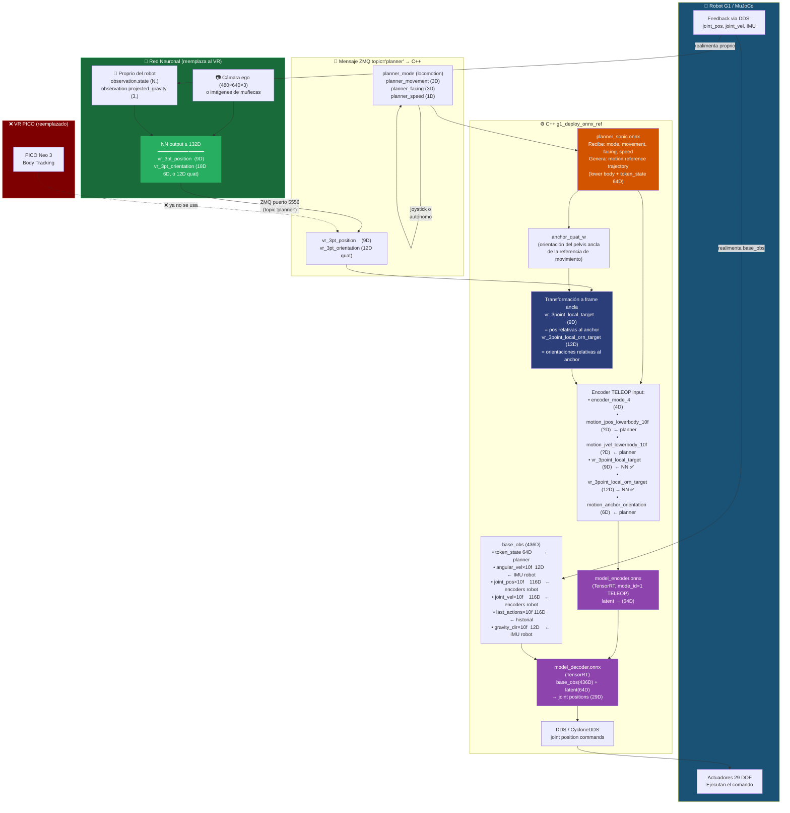

# ¿Son suficientes los 27D del VR 3-Point para autonomía? — Modo TELEOP (mode_id=1)

> **Pregunta:** Si una red neuronal predice `teleop.vr_3pt_position` (9D) +
> `teleop.vr_3pt_orientation` (18D) en lugar del PICO VR, ¿puede el robot operar
> de forma autónoma con esos datos?
>
> **Respuesta corta:** Sí, esos **27D son el reemplazo exacto y completo** de lo
> que el VR aporta al encoder en modo TELEOP. Pero el pipeline tiene **otros
> componentes que siguen necesitando datos propios del robot** (IMU, encoder de
> articulaciones, planner de piernas). La NN solo sustituye la parte humana del
> bucle.

---

## 1. Lo que necesita el Encoder TELEOP (mode_id = 1)

Fuente: `gear_sonic_deploy/policy/release/observation_config.yaml`, sección
`encoder_modes / name: "teleop"`:

```yaml
required_observations:
  - encoder_mode_4                                  # (4D)  one-hot del modo
  - motion_joint_positions_lowerbody_10frame_step5  # (??D) referencia lower body del planner
  - motion_joint_velocities_lowerbody_10frame_step5 # (??D) ídem velocidades
  - vr_3point_local_target                          # (9D)  ← viene del VR
  - vr_3point_local_orn_target                      # (12D) ← viene del VR
  - motion_anchor_orientation                       # (6D)  orientación del pelvis ancla
```

### ¿Qué viene del VR y qué viene del robot?

| Observación del encoder | Origen | ¿Reemplazable por NN? |
|------------------------|--------|----------------------|
| `encoder_mode_4` | Constante (mode_id=1) | — |
| `motion_joint_positions_lowerbody_10frame_step5` | **Planner** (referencia de movimiento generada por `planner_sonic.onnx`) | No (es el planner de piernas) |
| `motion_joint_velocities_lowerbody_10frame_step5` | **Planner** (idem) | No |
| `vr_3point_local_target` | **VR PICO** → `vr_3pt_position` (9 floats) | ✅ Sí — es lo que la NN predice |
| `vr_3point_local_orn_target` | **VR PICO** → `vr_3pt_orientation` (12 floats quat) | ✅ Sí — es lo que la NN predice |
| `motion_anchor_orientation` | **Planner** (orientación del frame ancla) | No |

Y el **base_obs** (436D, que va directo al decoder sin pasar por encoder):

```
token_state                         (64D)  ← planner genera esto
his_base_angular_velocity_10frame   (12D)  ← IMU del robot
his_body_joint_positions_10frame    (116D) ← encoders del robot
his_body_joint_velocities_10frame   (116D) ← encoders del robot
his_last_actions_10frame            (116D) ← acciones enviadas
his_gravity_dir_10frame             (12D)  ← IMU del robot
```

**Ninguno de estos viene del VR.**

### Conclusión de la tabla:
La NN solo necesita predecir **`vr_3pt_position` (9) + `vr_3pt_orientation`** para
reemplazar al PICO en modo TELEOP. El planner de piernas, el IMU, los encoders y
el `token_state` son completamente independientes del VR y siguen siendo provistos
por el hardware del robot y el proceso C++.

> **Nota sobre dimensiones de orientación:**
> En el **dataset** se guarda `teleop.vr_3pt_orientation` como **18D** (3 rotaciones
> × 6D rotation). El encoder C++ internamente recibe **12D** (3 rotaciones × 4D
> quaternion). La conversión 6D → quaternion está en el C++. Tu NN puede predecir
> en cualquiera de las dos representaciones y convertir.

---

## 2. Flujo completo: dónde entra la NN



---

## 3. ¿Qué predice exactamente la NN y en qué dimensiones?

```
Salida NN (total = 27D, bien dentro del límite de 132D):
┌─────────────────────────────────────────────────────────────┐
│  vr_3pt_position  (9D)                                      │
│  ┌─────────────────┬────────────────┬─────────────────┐     │
│  │ L-Wrist pos     │ R-Wrist pos    │ Neck pos        │     │
│  │ [x, y, z]       │ [x, y, z]      │ [x, y, z]       │     │
│  │ (3D)            │ (3D)           │ (3D)            │     │
│  └─────────────────┴────────────────┴─────────────────┘     │
│  FRAME: robot frame, relativo al pelvis/root                │
│                                                             │
│  vr_3pt_orientation  (18D en 6D-rotation, o 12D en quat)   │
│  ┌─────────────────┬────────────────┬─────────────────┐     │
│  │ L-Wrist rot     │ R-Wrist rot    │ Neck rot        │     │
│  │ (6D)            │ (6D)           │ (6D)            │     │
│  └─────────────────┴────────────────┴─────────────────┘     │
│  FRAME: idem, relativo al root                              │
└─────────────────────────────────────────────────────────────┘
```

Estos datos en el dataset están en `teleop.vr_3pt_position` y
`teleop.vr_3pt_orientation` — con los nombres de las features exactos de
`gear_sonic/data/features_sonic_vla.py`:

```python
"teleop.vr_3pt_position":    shape (9,),   # lwrist xyz, rwrist xyz, neck xyz
"teleop.vr_3pt_orientation": shape (18,),  # 3 × rot6D (convertido a quat en C++)
```

---

## 4. Qué sigue siendo necesario fuera de la NN

| Componente | Función | ¿Lo puede reemplazar la NN? |
|------------|---------|----------------------------|
| **Planner ONNX** (`planner_sonic.onnx`) | Genera referencia de movimiento del lower body + `token_state` 64D | No. El planner puede ponerse en modo IDLE (piernas quietas) pero hay que pasarle al menos un locomotion command |
| **IMU del robot** | `projected_gravity`, `base_angular_velocity` → `base_obs` | No |
| **Encoders de articulaciones del robot** | `joint_positions`, `joint_velocities` → `base_obs` + feedback para `PROPRIO` de la NN | No |
| **C++ Deployment** | Corre encoder+decoder en TensorRT, gestiona planner, envía por DDS | No (es el runtime de la política) |

---

## 5. Lo que tienes que hacer para sustituir el PICO

1. **Tu NN** (que recibe visión + proprio del robot) predice **27D** en cada timestep:
   `[vr_3pt_position (9), vr_3pt_orientation (18)]`

2. **Empaquetarlos** en el mismo formato que `build_planner_message()` del proceso
   Python (`pico_manager_thread_server.py`). Los campos extra del mensaje
   (`planner_mode`, `planner_movement`, `planner_facing`, `planner_speed`) pueden ir
   como ceros/IDLE si el robot está parado, o con un sub-policy de locomoción
   aparte.

3. **Publicar por ZMQ** en `tcp://localhost:5556` con topic `planner`. El proceso
   C++ (`g1_deploy_onnx_ref`) ya está esperando ese mensaje.

4. El C++ hace el resto: transforma a frame ancla, corre encoder TELEOP (mode_id=1),
   concatena con `base_obs`, pasa por decoder y envía joint commands por DDS.

---

## 6. Resumen en una línea

> Los **27D** son el reemplazo **100% fiel** del aporte del VR al encoder en modo
> TELEOP. Todo lo demás (planner de piernas, IMU, encoders del robot, C++ runtime)
> sigue funcionando igual — la NN solo ocupa el lugar del operador humano con el
> casco.
