## SMPL encoder direct (v2): trace end-to-end

Este documento describe **qué datos se envían en modo SMPL** desde `gear_sonic/scripts/pico_manager_thread_server.py` (topic ZMQ `pose`), cómo los consume `gear_sonic_deploy` (input-type `zmq_manager`), y **qué entra realmente al encoder** (lo que aquí llamamos **`vsi_smpl`**: *encoder observation vector para `mode_id=2`*), incluyendo **origen** y **shape** de cada variable.

### Contexto de ejecución (pipeline)

- **Servidor de tracking / publisher**: `gear_sonic/scripts/pico_manager_thread_server.py`
  - Crea un ZMQ `PUB` y hace `bind("tcp://*:5556")` (por defecto).
  - Publica mensajes “packed” con header JSON (1280 bytes) + payload binario (ver `gear_sonic/utils/teleop/zmq/zmq_planner_sender.py`).
- **Deploy (subscriber + policy + encoder)**: `gear_sonic_deploy/deploy.sh`
  - Lanza el binario C++ `g1_deploy_onnx_ref` vía `just run g1_deploy_onnx_ref ... --input-type manager --zmq-host localhost ...`
  - Con `--input-type zmq_manager` se usa `ZMQManager`:
    - topic `command`: start/stop/mode switch
    - topic `planner`: locomotion/planner commands
    - topic `pose`: streamed motion (SMPL/joints)
- **Sim loop**: `gear_sonic/scripts/run_sim_loop.py`
  - Inicializa MuJoCo + robot model. No define el schema SMPL; el schema SMPL relevante viene del ZMQ `pose` publicado por `pico_manager_thread_server.py`.

### Resumen rápido: ¿qué es “modo SMPL” aquí?

En `g1_deploy_onnx_ref`, cuando se recibe `pose` con **protocol v3** (ver `gear_sonic_deploy/.../include/input_interface/zmq_endpoint_interface.hpp`), el `MotionSequence` resultante se marca con:

- **`encode_mode = 2` (SMPL-based)**.

Luego, el **encoder** (modelo ONNX/TensorRT) recibe un vector de observaciones seleccionado por `gear_sonic_deploy/policy/release/observation_config.yaml`, sección:

- `encoder.encoder_modes[].name == "smpl"`, `mode_id: 2`

y por tanto el encoder consume la concatenación de:

- `encoder_mode_4`
- `smpl_joints_10frame_step1`
- `smpl_anchor_orientation_10frame_step1`
- `motion_joint_positions_wrists_10frame_step1`

Ese vector concatenado es lo que llamamos **`vsi_smpl`** en esta documentación.

---

## 1) Mensaje ZMQ `pose` publicado por `pico_manager_thread_server.py`

### 1.1 Dónde se arma y se envía

En `PoseStreamer.run_once()` (dentro de `pico_manager_thread_server.py`) se construye un dict `numpy_data` y se envía con:

- `packed_message = pack_pose_message(numpy_data, topic="pose")`
- `socket.send(packed_message)`

### 1.2 Campos principales y shapes (protocol v3)

Sea:

- \(N =\) `num_frames_to_send` (default: 5)
- SMPL joints: 24
- SMPL poses (axis-angle): 21
- Robot joints: 29

Campos que efectivamente salen en el `pose` message cuando el buffer está lleno:

- **`smpl_pose`**: `float32`, shape **`(N, 21, 3)`**
  - Axis-angle (rotvec) local por joint (21 joints usados por el encoder; proviene de SMPL 24 local rotations pero se recorta/arma a 21 en el pipeline).
- **`smpl_joints`**: `float32`, shape **`(N, 24, 3)`**
  - Posiciones 3D por joint SMPL en frame local (ver detalle de origen abajo).
- **`body_quat_w`**: `float32`, shape **`(N, 4)`**
  - Quaternion (wxyz) del root/global orient (con ajustes SMPL opcionales).
- **`joint_pos`**: `float64` (por default numpy), shape **`(N, 29)`**
  - En este script se setean explícitamente **6 DOFs de wrist** (roll/pitch/yaw L/R) a partir de SMPL; el resto queda 0.
- **`joint_vel`**: `float64`, shape **`(N, 29)`**
  - Aquí se manda en cero.
- **`vr_position`**: `float32`, shape **`(9,)`**
  - 3 puntos (L-wrist, R-wrist, neck) concatenados: 3×xyz.
- **`vr_orientation`**: `float32`, shape **`(12,)`**
  - 3 quaternions concatenados: 3×(wxyz).
- **`frame_index`**: `int64`, shape **`(N,)`**
- **`heading_increment`**: `float32`, shape **`(1,)`**
- **`left_hand_joints`**, **`right_hand_joints`**: `float32`, shape **`(7,)`** cada uno
- **`left_trigger`**, **`right_trigger`**, **`left_grip`**, **`right_grip`**: `float32`, shape **`(1,)`** cada uno
- **`toggle_data_collection`**, **`toggle_data_abort`**: `bool`, shape **`(1,)`** cada uno
- **`pico_dt`**, **`pico_fps`**: `float32`, shape **`(1,)`**
- **`timestamp_realtime`**, **`timestamp_monotonic`**: `float64`, shape **`(1,)`**

Notas:

- El subscriber C++ (`ZMQPackedMessageSubscriber`) no requiere conocer el schema: usa el header JSON que incluye `name`, `dtype`, `shape` por campo.
- Para el **modo SMPL**, los campos realmente críticos para el encoder son: `smpl_joints`, `body_quat_w`, y `joint_pos` (wrist subset), porque de ahí se derivan las observaciones del encoder listadas en `observation_config.yaml`.

---

## 2) Origen de cada campo SMPL en `pico_manager_thread_server.py`

### 2.1 Fuente primaria: `xrt.get_body_joints_pose()`

`PicoReader._run()` llama:

- `body_poses = xrt.get_body_joints_pose()`
- `sample["body_poses_np"] = np.array(body_poses)`

Shape esperado (por docstring de `_process_3pt_pose`):

- **`sample["body_poses_np"]`**: shape **`(24, 7)`**, por joint:
  - `[x, y, z, qx, qy, qz, qw]` en frame Unity (quat scalar-last)

Además agrega timestamps/dt/fps.

### 2.1.1 Variables “madre” (modo SMPL)

En modo SMPL, casi todo lo que viaja en el mensaje `pose` se puede derivar de un conjunto pequeño de fuentes/estados:

- **`body_poses_np`** (`sensor externo (pico/xrt)`) — **principal**: `xrt.get_body_joints_pose()` → `np.array(...)`, shape **`(24, 7)`** con `[x, y, z, qx, qy, qz, qw]` (Unity frame, quat scalar-last).
- **`timestamp_ns`** (`sensor externo (pico/xrt)`) — `xrt.get_time_stamp_ns()` (base para `pico_dt/pico_fps` y para el resampling/interpolación a `target_fps`).
- **Entradas de control Pico** (`sensor externo (pico/xrt)`):
  - **Triggers/Grips**: `left_trigger/right_trigger/left_grip/right_grip`
  - **Botones**: `A/B/X/Y`
  - **Joysticks**: ejes `lx/ly/rx/ry` (en particular `rx` alimenta `heading_increment`)
- **Clocks del host** (`sensor externo (host)`) — `time.time()` y `time.monotonic()` para `timestamp_realtime/timestamp_monotonic`.
- **Estado interno de streaming** (no-sensor): `prev_smpl_pose_np`, `prev_smpl_joints_np`, `prev_body_quat_np`, `prev_stamp_ns`, `next_target_ns`, `PoseStreamer.step`, y el estado de `YawAccumulator` (para `heading_increment`).

En resumen: **`body_poses_np` + `timestamp_ns` + inputs de controller + clocks del host + estado previo de interpolación** explican la procedencia de todos los campos listados en 1.2.

### 2.2 De `body_poses_np` a `latest_data` (SMPL tensors)

En `PoseStreamer.run_once()`:

1) Llama a:

- `latest_data = compute_from_body_poses(parent_indices, device, sample["body_poses_np"])`

2) `compute_from_body_poses()` hace:

- `positions = body_poses_np[:, :3]` → shape `(24, 3)`
- `global_quats = body_poses_np[:, [6,3,4,5]]` → reordena a **(qw,qx,qy,qz)**, shape `(24,4)`
- Convierte a rotaciones globales, aplica un ajuste fijo `* euler("y", 180°)`
- Calcula rotaciones **locales** usando `parent_indices`
- Convierte local rotations a rotvec:
  - `pose_aa`: shape `(24,3)`
- Construye tensores:
  - `body_pose = pose_aa[1:].flatten()` → shape `(1, 23*3)`; luego el pipeline downstream recorta a 21*3 al exportar.
  - `global_orient = pose_aa[0]` → shape `(1,3)`
  - `transl = positions[0]` → shape `(1,3)`
- Llama `process_smpl_joints(body_pose, global_orient, transl)`

3) `process_smpl_joints()` (en este mismo archivo) retorna un dict con:

- **`smpl_pose`**: tensor con axis-angles (incluye global/root + body pose)
- **`smpl_joints_local`**: tensor con joints locales (shape típica `(1,24,3)`)
- **`global_orient_quat`**: quaternion del root/global orient (wxyz o xyzw según helper; aquí se usa como fuente de `body_quat_w`)

### 2.3 Construcción de `smpl_pose_np`, `smpl_joints_np`, `body_quat_np`

En `PoseStreamer.run_once()`:

- `smpl_pose_np = latest_data["smpl_pose"] ... [:, :63].reshape(-1, 21, 3)[0]`
  - **Origen**: `latest_data["smpl_pose"]` (tensor)
  - **Destino**: frame axis-angle 21×3 (solo 21 joints → 63 floats)
- `smpl_joints_np = latest_data["smpl_joints_local"][0]`
  - **Origen**: `latest_data["smpl_joints_local"]` (tensor `(1,24,3)`)
  - **Destino**: `float32 (24,3)`
- `body_quat_np = latest_data["global_orient_quat"][0]`
  - **Origen**: `latest_data["global_orient_quat"]` (tensor `(1,4)`)
  - **Destino**: `float32 (4,)`

Luego se hace **interpolación temporal** para samplear a `target_fps`:

- `use_pose`: interpolación en axis-angle (via quats) → `(21,3)`
- `use_joints`: lerp → `(24,3)`
- `use_body_quat`: lerp + normalize → `(4,)`

### 2.3.1 Dependencias por campo (formato `variable(dep1, dep2, ...)`)

Convención:

- `sensor externo (pico/xrt)` = viene directo del SDK del Pico/XRoboToolkit.
- `sensor externo (host)` = viene de clocks del sistema local (PC).
- Cuando hay estado temporal (interpolación), se listan también las variables `prev_*` relevantes.

- **`smpl_pose`**  
  `smpl_pose(sensor externo (pico/xrt): body_poses_np, parent_indices, target_fps, sensor externo (pico/xrt): timestamp_ns, estado: prev_smpl_pose_np, prev_stamp_ns, next_target_ns)`
- **`smpl_joints`**  
  `smpl_joints(sensor externo (pico/xrt): body_poses_np, parent_indices, compute_human_joints (SMPL), global_orient_quat, estado: prev_smpl_joints_np, prev_stamp_ns, next_target_ns)`
  - Nota: en el código se origina como `smpl_joints_local` y se exporta como `smpl_joints`.
- **`body_quat_w`**  
  `body_quat_w(sensor externo (pico/xrt): body_poses_np, parent_indices, (opcional) smpl_root_ytoz_up, (opcional) remove_smpl_base_rot, estado: prev_body_quat_np, target_fps, sensor externo (pico/xrt): timestamp_ns, prev_stamp_ns, next_target_ns)`
- **`joint_pos`**  
  `joint_pos(smpl_pose, decompose_rotation_aa)`
  - Solo setea 6 DOFs (wrists). El resto queda en 0.
- **`joint_vel`**  
  `joint_vel(constante 0)`
- **`vr_position`**  
  `vr_position(sensor externo (pico/xrt): body_poses_np, OFFSETS, estado: ThreePointPose calibration)`
- **`vr_orientation`**  
  `vr_orientation(sensor externo (pico/xrt): body_poses_np, OFFSETS, estado: ThreePointPose calibration)`
- **`frame_index`**  
  `frame_index(estado: PoseStreamer.step)`
- **`heading_increment`**  
  `heading_increment(sensor externo (pico/xrt): controller_axes.rx, estado: YawAccumulator(yaw_gain, deadzone, yaw_angle_rad, dyaw), frame_time)`
- **`left_hand_joints`**  
  `left_hand_joints(sensor externo (pico/xrt): left_trigger, sensor externo (pico/xrt): left_grip, (opcional externo) G1GripperInverseKinematicsSolver, generate_finger_data)`
  - Si el solver no está disponible: `left_hand_joints(constante 0)`.
- **`right_hand_joints`**  
  `right_hand_joints(sensor externo (pico/xrt): right_trigger, sensor externo (pico/xrt): right_grip, (opcional externo) G1GripperInverseKinematicsSolver, generate_finger_data)`
  - Si el solver no está disponible: `right_hand_joints(constante 0)`.
- **`left_trigger`**  
  `left_trigger(sensor externo (pico/xrt))`
- **`right_trigger`**  
  `right_trigger(sensor externo (pico/xrt))`
- **`left_grip`**  
  `left_grip(sensor externo (pico/xrt))`
- **`right_grip`**  
  `right_grip(sensor externo (pico/xrt))`
- **`toggle_data_collection`**  
  `toggle_data_collection(sensor externo (pico/xrt): A_button, sensor externo (pico/xrt): left_grip, estado: toggle_data_collection_last)`
- **`toggle_data_abort`**  
  `toggle_data_abort(sensor externo (pico/xrt): B_button, sensor externo (pico/xrt): left_grip, estado: toggle_data_abort_last)`
- **`pico_dt`**  
  `pico_dt(sensor externo (pico/xrt): timestamp_ns_actual, sensor externo (pico/xrt): timestamp_ns_prev)`
- **`pico_fps`**  
  `pico_fps(pico_dt, estado: PicoReader._fps_ema)`
- **`timestamp_realtime`**  
  `timestamp_realtime(sensor externo (host): time.time())`
- **`timestamp_monotonic`**  
  `timestamp_monotonic(sensor externo (host): time.monotonic())`

### 2.4 `joint_pos` (wrist DOFs) derivado de `use_pose`

El script deriva algunos DOFs de muñeca del robot directamente desde SMPL:

- `body_pose = use_pose.reshape(-1, 21, 3)` → `(1,21,3)`
- extrae axis-angle de indices SMPL:
  - `SMPL_L_ELBOW_IDX=17`, `SMPL_L_WRIST_IDX=19`, `SMPL_R_ELBOW_IDX=18`, `SMPL_R_WRIST_IDX=20`
- descompone rotación de codo (twist/swing) y “mueve” parte del swing a la muñeca
- convierte a euler y construye:
  - `g1_l_wrist_roll/pitch/yaw`
  - `g1_r_wrist_roll/pitch/yaw`
- inserta en un vector:
  - `joint_pos`: shape `(29,)`, solo setea índices wrist:
    - `23,25,27` (left roll/pitch/yaw)
    - `24,26,28` (right roll/pitch/yaw)

Este `joint_pos` es el que termina alimentando la observación del encoder:

- `motion_joint_positions_wrists_10frame_step1` (ver sección 4)

---

## 3) Cómo `gear_sonic_deploy` consume el `pose` message (y por qué esto es SMPL)

### 3.1 Suscripción

En C++:

- `ZMQManager` crea internamente un `ZMQEndpointInterface` para topic `pose`.
- `ZMQEndpointInterface` usa `ZMQPackedMessageSubscriber` (ZMQ SUB) para recibir y decodificar el header+payload.

### 3.2 Protocol version relevante

`pico_manager_thread_server.py` usa `pack_pose_message(..., version=3)` por default.

En `ZMQEndpointInterface`:

- **protocol v3** requiere: `joint_pos`, `joint_vel`, `smpl_joints`, `smpl_pose`, `body_quat_w`, `frame_index`.
- Cuando el motion se arma desde ZMQ con v2/v3, se hace:
  - `motion->SetEncodeMode(2)` (SMPL-based)

---

## 4) Qué entra al encoder en modo SMPL (=`vsi_smpl`)

### 4.1 Definición de `vsi_smpl`

En `gear_sonic_deploy/policy/release/observation_config.yaml`:

- `encoder_modes:`
  - `name: "smpl"`
  - `mode_id: 2`
  - `required_observations:`:
    - `encoder_mode_4`
    - `smpl_joints_10frame_step1`
    - `smpl_anchor_orientation_10frame_step1`
    - `motion_joint_positions_wrists_10frame_step1`

Por tanto:

- **`vsi_smpl`** = concatenación (en ese orden) de esas 4 observaciones.

Dimensión total:

- `encoder_mode_4`: 4
- `smpl_joints_10frame_step1`: \(10 \times 24 \times 3 = 720\)
- `smpl_anchor_orientation_10frame_step1`: \(10 \times 6 = 60\)
- `motion_joint_positions_wrists_10frame_step1`: \(10 \times 6 = 60\)
- **Total**: **844**

### 4.2 Origen exacto de cada bloque (desde Pico hasta encoder)

#### A) `encoder_mode_4` (shape: `(4,)`)

- **Origen**: `MotionSequence.encode_mode`
  - En streaming SMPL (protocol v3): se fija a `2`.
- **Construcción**: `GatherEncoderMode(buf, offset, fill_zeros_num=3)`
  - Es `[2, 0, 0, 0]`.

#### B) `smpl_joints_10frame_step1` (shape: `(720,)` = `10×24×3`)

- **Origen remoto (ZMQ)**: `pose["smpl_joints"]` publicado por `PoseStreamer`
  - `smpl_joints`: `(N,24,3)` por mensaje (default N=5 por batch)
- **Decode**: `ZMQEndpointInterface` decodifica a `decoded_smpl_joints[frame][joint][xyz]`
- **Merge**: `StreamedMotionMerger` lo integra a `MotionSequence::SmplJoints(t)`
- **Gather para encoder**: `GatherMotionSmplJointsMultiFrame(num_frames=10, step_size=1)`
  - Toma 10 frames futuros desde `current_frame_` (si `operator_state.play`), clamp al final si hace falta.

#### C) `smpl_anchor_orientation_10frame_step1` (shape: `(60,)` = `10×6`)

Es un 6D rotation (primeras 2 columnas de la matriz de rotación) que codifica una orientación “anchor” entre robot y referencia:

- **Origen remoto (ZMQ)**: `pose["body_quat_w"]` (root quaternion por frame)
  - Publicado por `PoseStreamer` como stack `(N,4)`
  - Sale de `latest_data["global_orient_quat"]` (SMPL root orient, con ajustes opcionales `smpl_root_ytoz_up/remove_smpl_base_rot`)
- **Uso local (robot)**: `base_quat` del robot (IMU/state logger) dentro de `g1_deploy_onnx_ref`
- **Construcción**: `GatherMotionAnchorOrientationMutiFrame(num_frames=10, step_size=1, orientation_mode=0)`
  - Computa:
    - `apply_delta_heading = ComputeApplyDeltaHeading()`
    - `new_ref_root_rot = apply_delta_heading * ref_data_root_rot` (donde `ref_data_root_rot` viene del motion, o sea del streamed `body_quat_w`)
    - `base_to_ref_quat = inv(base_quat) * new_ref_root_rot`
    - `quat_to_rotation_matrix(base_to_ref_quat)[:,:2]` flatten row-wise → 6D

#### D) `motion_joint_positions_wrists_10frame_step1` (shape: `(60,)` = `10×6`)

Este bloque se construye a partir de los **targets de joints** del `MotionSequence` (streamed motion):

- **Origen remoto (ZMQ)**: `pose["joint_pos"]` (N×29)
  - En `pico_manager_thread_server.py` solo se llenan 6 wrist DOFs; el resto 0.
- **Decode/Merge**: queda como `MotionSequence::JointPositions(t)` (29D por frame)
- **Gather**: `GatherMotionJointPositionsMultiFrame(num_frames=10, step_size=1, joint_indexes=wrist_joint_isaaclab_order_in_isaaclab_index)`
  - Extrae 6 joints de muñecas por frame × 10 frames.

---

## 5) Diagrama Mermaid: origen → mensaje → motion → `vsi_smpl` → encoder

```mermaid
flowchart LR
  %% Sources
  XRT["XRoboToolkit (Pico)\nget_body_joints_pose()\nbody_poses_np (24,7)"] --> PR["PicoReader\nsample dict"]

  %% SMPL processing in python
  PR --> CFP["compute_from_body_poses()\npositions (24,3)\nlocal rotvec pose_aa (24,3)"]
  CFP --> PSJ["process_smpl_joints()\nsmpl_pose (tensor)\nsmpl_joints_local (1,24,3)\nglobal_orient_quat (1,4)"]

  PSJ --> USE["PoseStreamer interpolation\nuse_pose (21,3)\nuse_joints (24,3)\nuse_body_quat (4,)"]
  USE --> WR["Wrist mapping\njoint_pos (29,) only wrists set"]
  USE --> VR["ThreePointPose\nvr_3pt_pose (3,7) -> vr_position(9), vr_orientation(12)"]

  %% ZMQ packing
  USE --> MSG["numpy_data dict\nsmpl_joints (N,24,3)\nsmpl_pose (N,21,3)\nbody_quat_w (N,4)\nframe_index (N)\n..."]
  WR --> MSG
  VR --> MSG
  MSG --> ZMQ["ZMQ PUB topic='pose'\npack_pose_message(v=3)"]

  %% Deploy side
  ZMQ --> SUB["ZMQEndpointInterface\nZMQPackedMessageSubscriber SUB\nDecode header+payload"]
  SUB --> MERGE["StreamedMotionMerger\n-> MotionSequence\nencode_mode=2 (SMPL)"]

  %% Encoder obs vector (vsi_smpl)
  MERGE --> V0["encoder_mode_4 = [2,0,0,0]"]
  MERGE --> V1["smpl_joints_10frame_step1\n(10*24*3)=720"]
  MERGE --> V2["smpl_anchor_orientation_10frame_step1\n(10*6)=60\nuses robot base_quat + motion body_quat_w"]
  MERGE --> V3["motion_joint_positions_wrists_10frame_step1\n(10*6)=60"]

  V0 --> VSI["vsi_smpl (844D)\nconcat[V0,V1,V2,V3]"]
  V1 --> VSI
  V2 --> VSI
  V3 --> VSI

  VSI --> ENC["EncoderEngine (TensorRT)\nEncode() -> token_state (dim=64)"]
```

---

## 6) “Datos principales” que se envían en este modo (SMPL)

Si tu objetivo es entender **lo mínimo necesario** para el encoder en modo SMPL, lo crítico es:

- **`smpl_joints`**: `(N,24,3)` (local joint positions)
- **`body_quat_w`**: `(N,4)` (root orientation quaternion)
- **`joint_pos`**: `(N,29)` (en la práctica: solo 6 wrist DOFs con señal, el resto 0)
- **`frame_index`**: `(N,)` (alineación temporal en el merger)

El resto (`vr_position`, triggers, timestamps, heading_increment, etc.) puede ser útil para teleop/diagnóstico, pero **no forma parte del `vsi_smpl`** requerido por `encoder_modes.smpl` en el config release actual.
