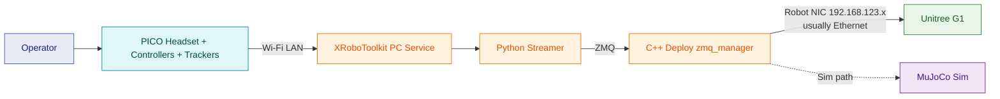
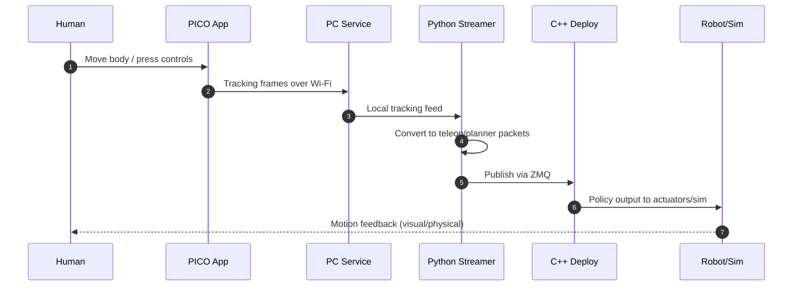
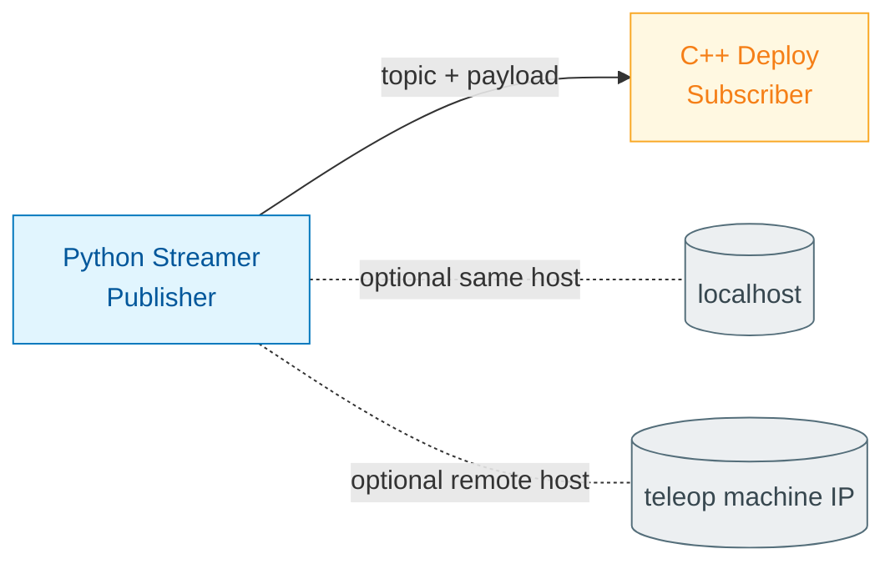

# Understanding Teleop

Short, didactic map of how this teleoperation stack works.

## 1) Components and roles

- **Human + PICO hardware**: body motion and button input source.
- **XRoboToolkit app (headset)**: packages tracking data and sends it over Wi-Fi.
- **XRoboToolkit PC Service**: receives headset stream on laptop and exposes it to local apps.
- **Python teleop streamer** (`pico_manager_thread_server.py --manager`): converts tracking to control messages and publishes them.
- **C++ deploy (`zmq_manager`)**: subscribes to teleop messages and drives policy output.
- **Robot or MuJoCo sim**: executes final commands.

## 2) System schematic (real + sim routes)

Important:
- **PICO -> laptop** is usually Wi-Fi LAN.
- **Laptop -> G1** is usually a **dedicated robot NIC** (`192.168.123.x`), typically Ethernet.
- So yes, it is still "IP networking", but in practice robot link is normally cable for stability.

### Camera note (important)

- In the **GEAR-SONIC teleop path** above, core teleoperation uses body/pose + controller data; camera is not mandatory for basic control loop.
- The robot has integrated sensors, but camera streaming is handled by specific modules/workflows (not the minimum PICO teleop bring-up flow).
- In this repo, camera-forwarder references appear more explicitly in `decoupled_wbc` workflows.

## 3) Runtime sequence

## 4) What is ZMQ (ZeroMQ)?

- **ZMQ is a messaging library**, not a robot algorithm.
- It gives fast communication patterns (Pub/Sub, Req/Rep, Push/Pull) over TCP/in-process.
- In this stack, think: **Python streamer publishes**, **C++ deploy subscribes**.
- Benefit: decouples modules, so teleop source and robot control can run in different processes/machines.

### ZMQ in this repo (conceptual)

## 5) Mode intuition

- **POSE**: full-body SMPL from PICO drives body motion directly.
- **PLANNER**: locomotion command mode (joystick-like behavior).
- **VR_3PT**: upper-body tracking mode based on head/hands calibration.

## 6) Practical run order

1. Start PC service.
2. Connect PICO app to laptop IP (`WORKING`).
3. Run Python streamer (`--manager`).
4. Run C++ deploy with `--input-type zmq_manager` (for full closed-loop control).

## 7) Folders and key files (clickable)

### Core folders

- [`docs/`](./docs/) - official setup/tutorial docs.
- [`gear_sonic/`](./gear_sonic/) - Python teleop/sim side.
- [`gear_sonic_deploy/`](./gear_sonic_deploy/) - C++ deploy/runtime side.
- [`install_scripts/`](./install_scripts/) - environment setup scripts.
- [`external_dependencies/`](./external_dependencies/) - XRoboToolkit + Unitree deps.
- [`decoupled_wbc/`](./decoupled_wbc/) - decoupled WBC stack and assets.

### Key files to read first

- [`README.md`](./README.md)
- [`README_teleop.md`](./README_teleop.md)
- [`docs/source/getting_started/quickstart.md`](./docs/source/getting_started/quickstart.md)
- [`docs/source/getting_started/vr_teleop_setup.md`](./docs/source/getting_started/vr_teleop_setup.md)
- [`docs/source/tutorials/vr_wholebody_teleop.md`](./docs/source/tutorials/vr_wholebody_teleop.md)
- [`install_scripts/install_pico.sh`](./install_scripts/install_pico.sh)
- [`gear_sonic/scripts/pico_manager_thread_server.py`](./gear_sonic/scripts/pico_manager_thread_server.py)
- [`gear_sonic/scripts/run_sim_loop.py`](./gear_sonic/scripts/run_sim_loop.py)
- [`gear_sonic_deploy/deploy.sh`](./gear_sonic_deploy/deploy.sh)
- [`UNDERSTANDING_teleop.md`](./UNDERSTANDING_teleop.md)

## 8) Hardware note

AMD laptop is fine for headset/service/streaming side.  
Full deploy path in this repo usually expects NVIDIA CUDA/TensorRT on the C++ side.
